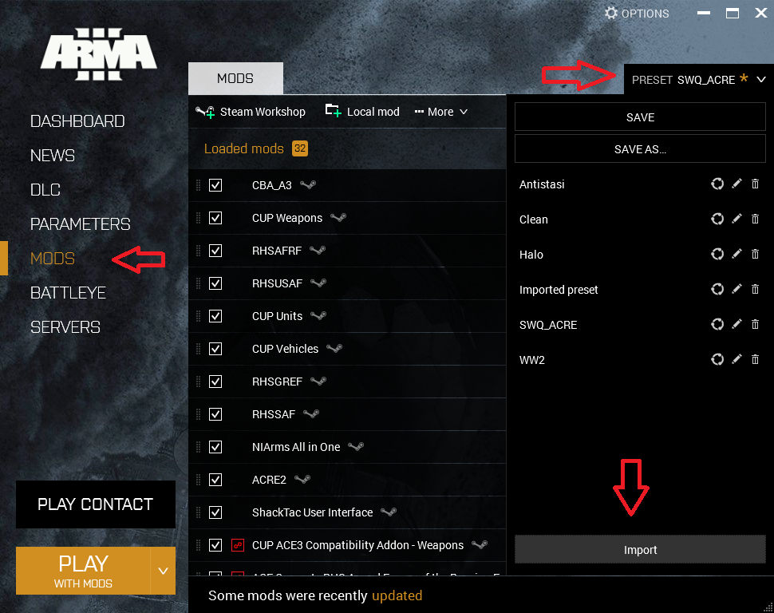

Bad Dudes has a regular mod list that is occasionally modified on a session by session basis. Check the `#announcements` channel of the Discord server at least a day prior to the session to download and test any additional mods needed for the session.

Mod lists can be exported and imported by the Arma launcher as HTML files. These mod list files can be opened in your browser to view a list of mods with links to each mod's Steam Workshop page. These files can also be imported directly into the Arma launcher.

## Required Files

Download the mod list file below.

ARMA modlist files are valid HTML and can be viewed in the browser to see a visual representation of the list. Follow the link and use `CTRL-S` to save the file locally to your computer for import into the ARMA launcher.

1. [Bad Dudes Mod List](assets/mod-installation/bad-dudes-mod-list.html)

## Importing the mod list

Importing the mod list into the Arma launcher will automatically subscribe you to the mods in the Steam Workshop and begin downloading the mods.

1. Launch Arma 3 and select `MODS` on the left column of the Arma Launcher.
2. Open the preset list at the top right.
3. Click the `Import` button at the bottom of the preset list.
4. Navigate to the `bad-dudes-mod-list.html` file you downloaded and click open.

Note that once installation of the mods is finished you may have multiple warnings for mods with unmet dependencies.You may ignore these errors and when prompted you should not select the option to automatically setup the missing dependencies. The mod list may contain a number of alternate versions of mods that will not match the exact dependencies specified in other mods but will provide the same functionality.

## Additional mods

Bad Dudes regularly uses a set of maps that aren't required for every session and are not included in the main mod list. An announcement prior to the session will be made if the one of these maps is required. If you like, you can subscribe to these Steam Workshop items to have them ready to go.

### Maps
* [Angola Maps](https://steamcommunity.com/sharedfiles/filedetails/?id=1446500688)
* [Bozcaada](https://steamcommunity.com/sharedfiles/filedetails/?id=5246226280)
* [Ihantala](https://steamcommunity.com/sharedfiles/filedetails/?id=1494115712)
* [Prei Khmaoch Luong Legacy](https://steamcommunity.com/sharedfiles/filedetails/?id=950966660)
* [Pulau](https://steamcommunity.com/sharedfiles/filedetails/?id=1423583812)
* [RHS Prei Khmaoch Luong](https://steamcommunity.com/sharedfiles/filedetails/?id=1978754337)
* [Ruha](https://steamcommunity.com/sharedfiles/filedetails/?id=1368857262)
* [Summa](https://steamcommunity.com/sharedfiles/filedetails/?id=1598087521)
* [Suursaari](https://steamcommunity.com/sharedfiles/filedetails/?id=1680294609)
* [Vidda | LEGACY VERSION](https://steamcommunity.com/sharedfiles/filedetails/?id=1282716647)

### Optional Client Side Mods
* [3den Enhanced](https://steamcommunity.com/sharedfiles/filedetails/?id=623475643)
* [Enhanced Video Settings](https://steamcommunity.com/sharedfiles/filedetails/?id=1223309664)
* [ShackTac User Interface](https://steamcommunity.com/sharedfiles/filedetails/?id=498740884)
    * This is an alternative to DUI - Squad Radar

## Alternate Mod Lists

Occasionally Bad Dudes will do series of sessions with an alternate mod list, such as our World War II themed mod list. These lists can be installed in the same method as the regular mod list. Unload all mods before importing a mod list. Unless otherwise specified all mods are included in the mod list.

* [World War II](assets/mod-installation/bad-dudes-wwii-mod-list.html)
* [S.O.G. Prairie Fire](assets/bad-dudes-soggers-mod-list.html)
* [SciFi](assets/mod-installation//bad-clones-mod-list.html)

## Previous Mods
* [Killoch's Multi-National Pack (mirror)](https://video.unlimitedbaka.works/@K_MNP.zip)